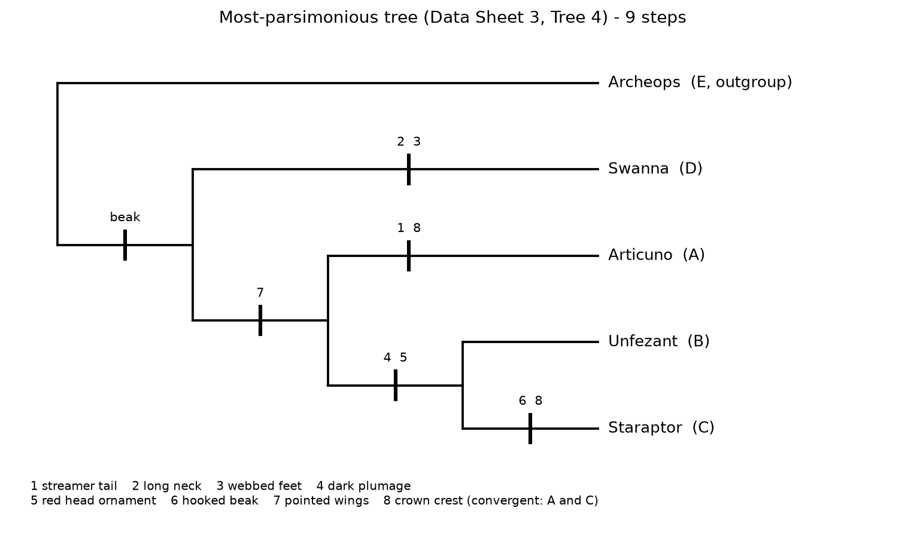

# Lab 10: Systematics and Macroevolution

Name: ________________________   Date: ________________________

Note on formatting: the lab asks for a different font color per character. To keep this black and white, each character is traced by its number (1-8) instead of a color. The numbers match across Data Sheet 1, Data Sheet 2, and the trees.

## Homologous structures (Fig. 2): which animals have five digits?

Five digits appear in the human, bat, whale, and crocodile forelimbs. Birds have three and horses have one. Five digits is the ancestral condition for tetrapods, so a group built around "has five digits" would be paraphyletic. It rests on a shared ancestral trait and leaves out the birds and horses, which descend from the same common ancestor but reduced their digit count.

## Three characters that show convergent evolution

| Character | At least two taxa in which it evolved convergently |
|-----------|----------------------------------------------------|
| Powered (flapping) flight | Birds and bats. Both build the wing from the same forelimb bones, but the flight surface differs (feathers vs. a skin membrane), and the two arose separately. |
| Echolocation | Bats and toothed whales (dolphins). High-frequency biological sonar evolved twice, and several hearing genes even changed in parallel. |
| Streamlined body with fins/flippers | Sharks (fish) and dolphins (mammals); the extinct ichthyosaurs (reptiles) share the same shape. Three separate ancestries, one fast-swimming form. |

## Phylogenetic reconstruction of bird-like Pokémon

Ingroup: Articuno (A), Unfezant (B), Staraptor (C), Swanna (D). Outgroup: Archeops (E).

**One obvious synapomorphy for the ingroup:** a true horny beak with no teeth. All four ingroup Pokémon have one, while Archeops keeps a toothed reptilian jaw. Feathered flight wings work as a second ingroup synapomorphy, since Archeops still has clawed fingers on its forelimbs.

### Data Sheet 1: Characters and Character States

The Archeops (outgroup) state is the ancestral state, coded 0 and shown in **bold**. The alternate state is derived, coded 1.

| # | Character | Outgroup (Archeops) | Ancestral state (0) | Derived state (1) |
|---|-----------|---------------------|---------------------|-------------------|
| (ex.) | Beak | Absent (toothed jaw) | **Absent** | Present |
| 1 | Long ribbon/streamer tail feathers | Absent | **Absent** | Present |
| 2 | Greatly elongated, swan-like neck | Absent | **Absent** | Present |
| 3 | Webbed feet | Absent (clawed toes) | **Clawed, not webbed** | Webbed |
| 4 | Dark gray-to-black body plumage | Absent (sandy, multicolored) | **Pale or colored** | Dark |
| 5 | Red ornamental head feathers (crest or plumes) | Absent (green head) | **Absent** | Present |
| 6 | Strongly hooked, raptorial beak tip | Absent | **Not hooked** | Hooked |
| 7 | Pointed, angular flight wings | Absent (short clawed arms) | **Rounded or short** | Pointed |
| 8 | Prominent erect crown crest | Absent (only small head feathers) | **Absent** | Present |

### Data Sheet 2: Character-state Matrix

0 = ancestral (Archeops) state, 1 = derived state.

| Taxon | Common name | 1 | 2 | 3 | 4 | 5 | 6 | 7 | 8 |
|-------|-------------|---|---|---|---|---|---|---|---|
| E | Archeops (outgroup) | 0 | 0 | 0 | 0 | 0 | 0 | 0 | 0 |
| A | Articuno | 1 | 0 | 0 | 0 | 0 | 0 | 1 | 1 |
| B | Unfezant | 0 | 0 | 0 | 1 | 1 | 0 | 1 | 0 |
| C | Staraptor | 0 | 0 | 0 | 1 | 1 | 1 | 1 | 1 |
| D | Swanna | 0 | 1 | 1 | 0 | 0 | 0 | 0 | 0 |

### Data Sheet 3: Steps for each of the 15 trees

Number of steps (total hatch marks for characters 1-8) on every tree:

| Tree | Steps | Tree | Steps | Tree | Steps |
|:----:|:-----:|:----:|:-----:|:----:|:-----:|
| 1 | 12 | 6 | 11 | 11 | 12 |
| 2 | 12 | 7 | 12 | 12 | 11 |
| 3 | 12 | 8 | 10 | 13 | 11 |
| 4 | **9** | 9 | 10 | 14 | 12 |
| 5 | 12 | 10 | 12 | 15 | 10 |

Tree 4 is the single shortest tree at 9 steps. The next-best trees (8, 9, and 15) each take 10 steps. The marked-up shortest tree is shown below; each hatch mark carries its character number, and character 8 appears twice because it is convergent.

## Questions

**What is the shortest tree and how many steps does it have?**

Tree 4, with 9 steps. It reads (Archeops, (Swanna, (Articuno, (Unfezant, Staraptor)))): Archeops is the outgroup, Swanna branches first inside the ingroup, Articuno branches next, and Unfezant and Staraptor are sisters.

**List two or three taxa that are monophyletic in your shortest tree.**

Unfezant and Staraptor form a clade. Articuno, Unfezant, and Staraptor form the next clade out. Both are monophyletic groups on Tree 4.

**What is one synapomorphic (shared derived) trait on your shortest tree?**

Dark gray-to-black plumage (character 4) is shared by Unfezant and Staraptor and marks their clade; the red head ornament (character 5) marks the same clade. One level out, pointed wings (character 7) unite Articuno, Unfezant, and Staraptor.

**Is there a convergent trait on your shortest tree? If so, what is it?**

Yes: the prominent crown crest (character 8). Articuno and Staraptor both have one, but the tree places Unfezant between them, so the crest had to arise twice on its own. Those two steps make it homoplasy rather than a shared inheritance.

**Does the topology in your shortest tree make sense to you? Why or why not?**

Mostly. Swanna is the odd one out, a swan with a long neck and webbed feet that lives partly on water, so its place at the base fits. Unfezant and Staraptor are both dark, taloned, crested land-birds, and they pair up. Articuno joins that group as its nearest relative. The soft spot is Articuno, a legendary bird built on a different scale, and the crest it shares with Staraptor turned out to be convergent rather than inherited. That is a useful warning that look-alike traits can pull unrelated taxa together.

**Do you think the outcome would change if you selected a different outgroup?**

It could. The outgroup sets polarity, telling you which state of each character is ancestral and which is derived. Archeops, a toothed early bird, makes the beak and the feathered wings look derived. Root the tree with something farther away, or with a diving bird, and a few traits I scored as derived might read as ancestral, which can shift the groupings. A closely related, well-chosen outgroup gives more trustworthy polarity.
